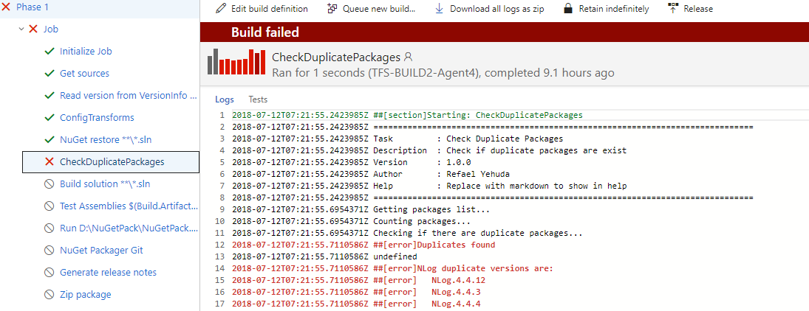

# Check duplications of NuGet packages

**Summary**  
This Build/Release extension is here to help you identify the usage of different versions of a certain NuGet package across multiple projects in a single solution in order to avoid version hell.

## Release Notes
* 0.1.0
    * First release

## What’s the problem?
You may have encountered a situation where your solution has 2 or more projects that each one of the projects uses different version of a certain NuGet package.

lets take NLog as an example:  
* **Project A** depends on NLog version 4.4.12.  
* **Project B** depends on NLog version 4.4.3.

**Project A** is a WebAPI project that its deployble artifact (Published website) has the standard folder layout with one Bin folder.

in order to make sure you will one version of the NLog package you can use the "Consolidate" tab in the NuGet package explorer in Visual studio.  
**But what happens if the dependancy is transitive?**  
 (A transitive dependency is an indirect dependency; you depend on something which itself has another dependency that you don’t depend on.)

## Solution:
The Build/Release task scans your packages folder in the root of the solution and looks for duplicate versions of a single NuGet package to avoid surprises in the PublishedWebSite bin folder.

##make you sure to place the task **after** the 'NuGet restore' task##
## Example:

Enter the required parameter values for the task:

**Working Directory**- Mandatory Field  
Default value is $(Build.SourcesDirectory)\packages

**Search Pattern**- Mandatory Field  
Default value is '(\\.+[\d]+)'  

